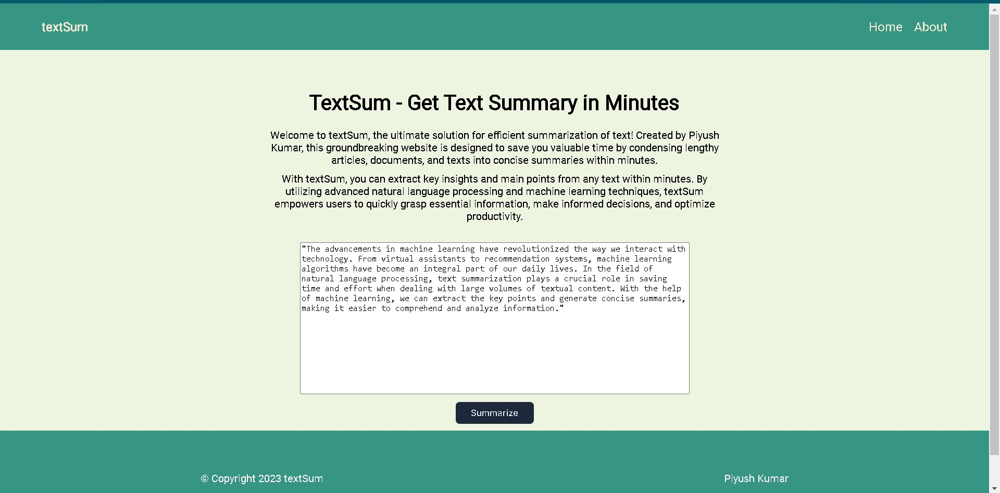
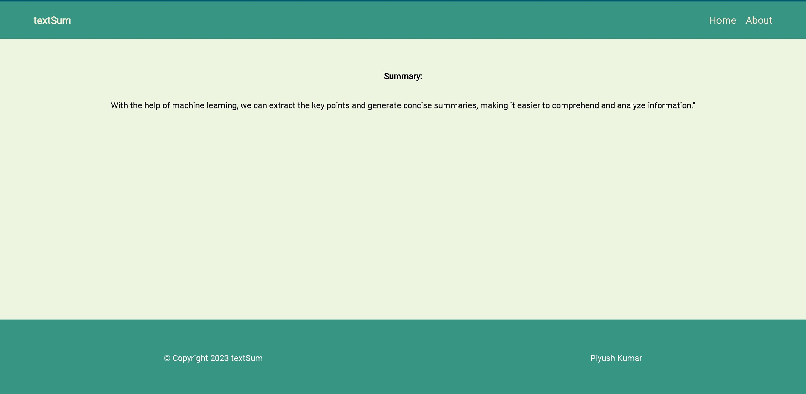

# Text Summarization Project

Welcome to my Text Summarization project! This project utilizes machine learning techniques to automatically generate concise summaries of given text inputs. In this README, I will provide an overview of the project and discuss the importance of machine learning in our daily lives.

## Table of Contents

- [Introduction](#introduction)
- [Features](#features)
- [Installation](#installation)
- [Usage](#usage)
- [Examples](#examples)
- [Contribution Guidelines](#Contribution-Guidelines)
- [License](#license)

## Introduction

In today's information-driven world, we are constantly bombarded with vast amounts of textual content from various sources. Digesting and understanding all this information can be a time-consuming task. Text summarization, a subfield of natural language processing (NLP), addresses this challenge by automatically extracting the most important information from a given text and presenting it in a concise manner.

This project aims to leverage the power of machine learning algorithms and techniques to build an effective text summarization system. By utilizing various NLP approaches, we can summarize large documents, articles, or even social media posts into key points, saving valuable time and effort for users.

## Features

- **Automatic Summarization**: The project employs machine learning models to automatically generate summaries of input text.
- **Efficiency**: The implemented algorithms ensure efficient processing of large volumes of text, enabling quick summarization even for lengthy documents.

## Installation

To install and set up the Text Summarization project, follow these steps:

1. Clone the repository: `git clone https://github.com/your-username/text-summarization.git`
2. Navigate to the project directory: `cd text-summarization`
3. Install the required dependencies: `pip install -r requirements.txt`
4. Download any additional resources or models as instructed in the project documentation.

## Usage

1. Import the necessary modules and classes into your Python script.
2. Load the pre-trained summarization model or train your own model using the provided training data.
3. Preprocess your input text by tokenizing and cleaning it, if required.
4. Pass the preprocessed text to the summarization model and retrieve the generated summary.
5. Utilize the summary for further analysis, decision-making, or any other desired purposes.

For detailed usage instructions and code examples, please refer to the project's documentation.

## Examples

Here are a few examples to demonstrate the effectiveness of the Text Summarization project:

**Example 1:**

Input Text:

`"The advancements in machine learning have revolutionized the way we interact with technology. From virtual assistants to recommendation systems, machine learning algorithms have become an integral part of our daily lives. In the field of natural language processing, text summarization plays a crucial role in saving time and effort when dealing with large volumes of textual content. With the help of machine learning, we can extract the key points and generate concise summaries, making it easier to comprehend and analyze information."`

Generated Summary:

`With the help of machine learning, we can extract the key points and generate concise summaries, making it easier to comprehend and analyze information."`

**Example 2:**

Input Text:

`Welcome to textSum, the ultimate solution for efficient summarization of text! Created by Piyush Kumar, this groundbreaking website is designed to save you valuable time by condensing lengthy articles, documents, and texts into concise summaries within minutes. With textSum, you can extract key insights and main points from any text within minutes. By utilizing advanced natural language processing and machine learning techniques, textSum empowers users to quickly grasp essential information, make informed decisions, and optimize productivity.`

Generated Summary:

`Created by Piyush Kumar, this groundbreaking website is designed to save you valuable time by condensing lengthy articles, documents, and texts into concise summaries within minutes.`

**Example 3:**

Input Text:

`Senior leader of India's opposition Congress party Rahul Gandhi's tour of the violence-hit Manipur state has been stopped abruptly by the police. Mr Gandhi is in the north-eastern state on a two-day visit to meet people displaced by the violence and leaders of civil society groups. For the past two months, Manipur has been convulsed by clashes between the majority Meitei and Kuki communities. More than 100 people have died and over 400 have been wounded so far. Prime Minister Narendra Modi has held a meeting with top government officials to review the situation in Manipur but he has been criticised for not visiting the state or commenting on the situation there. Almost a month after violence began, Home Minister Amit Shah visited the state to put in place a plan to restore normalcy, but fresh incidents of violence continue to be reported almost daily. After arriving in capital Imphal on Thursday morning, Mr Gandhi had shared a Facebook post saying that "restoration of peace is the top priority. Manipur needs healing, and only together we can bring harmony". But soon, senior Congress leader KC Venugopal told reporters that Mr Gandhi's convoy had been stopped by police near Bishnupur district while he was on his way to Churachandpur town to visit relief camps. "Police say that they are not in a position to allow us. People are standing on both sides of the road to wave to Rahul Gandhi. We are not able to understand why have they stopped us?" Mr Venugopal said. Police said the convoy had been stopped for Mr Gandhi's security. "Seeing the ground situation, we stopped him from moving forward and advised him to travel to Churachandpur via a helicopter," Heisnam Balram Singh, a senior police official at Bishnupur, told ANI. Party president Mallikarjun Kharge accused the Bharatiya Janata Party (BJP) government of "using autocratic methods to stall a compassionate outreach" by Mr Gandhi. "This is totally unacceptable and shatters all Constitutional and Democratic norms. Manipur needs peace, not confrontation," he tweeted. Congress MP Jairam Ramesh said Mr Gandhi's two-day visit to the state was in the spirit of his Bharat Jodo Yatra - a five-month long unity march across the country. "The Prime Minister may choose to remain silent or be inactive but why stop Rahul Gandhi's efforts to listen to all sections of the Manipuri society and provide a healing touch?" he said. However, some BJP leaders have criticised the timing of Mr Gandhi's visit, calling it politically motivated. Nearly 60,000 people have been displaced due to violence in Manipur and are taking shelter in some 350 camps. Mr Gandhi's visit comes amid the opposition's demand for the resignation of the state's chief minister, N Biren Singh, who is from the BJP. Congress leaders have criticised Mr Singh for not being able to "restore peace and normalcy" in the state and have asked for federal rule to be imposed. Broken dreams and burnt homes after India ethnic clashes Fears grow over Indian state on brink of civil war What made these grannies go nude in public? Mr Venugopal tweeted about Mr Gandhi's visit on Tuesday, and said that the state had been "burning for nearly two months" and "desperately needs a healing touch so that society can move from conflict to peace". Since the clashes began early in May, many homes, churches and temples have been destroyed by mobs while the homes of some state ministers and legislators have been attacked and set on fire. Close to 40,000 security forces have been deployed to quell the violence. But the situation continues to remain tense. Normal life has been thrown completely out of gear for the locals who are facing curfews, internet shutdowns and sporadic killings and arson.`

[link to article](https://www.bbc.com/news/world-asia-india-66050336)

Generated Summary:

`Mr Gandhi is in the north-eastern state on a two-day visit to meet people displaced by the violence and leaders of civil society groups.Prime Minister Narendra Modi has held a meeting with top government officials to review the situation in Manipur but he has been criticised for not visiting the state or commenting on the situation there."The Prime Minister may choose to remain silent or be inactive but why stop Rahul Gandhi's efforts to listen to all sections of the Manipuri society and provide a healing touch?"Congress leaders have criticised Mr Singh for not being able to "restore peace and normalcy" in the state and have asked for federal rule to be imposed.Mr Venugopal tweeted about Mr Gandhi's visit on Tuesday, and said that the state had been "burning for nearly two months" and "desperately needs a healing touch so that society can move from conflict to peace".Since the clashes began early in May, many homes, churches and temples have been destroyed by mobs while the homes of some state ministers and legislators have been attacked and set on fire.`

## Contribution Guidelines

We welcome and appreciate contributions to our project. To ensure a smooth collaboration, please follow these guidelines:

### Reporting Issues

If you encounter any issues or bugs, please submit a detailed bug report using the GitHub issue tracker. Include steps to reproduce the problem, expected behavior, and any relevant error messages.

### Feature Requests

If you have a suggestion for a new feature or improvement, please submit a feature request using the GitHub issue tracker. Provide a clear description of the proposed functionality and any relevant use cases.

### Pull Requests

We accept pull requests for bug fixes and new features. Before submitting a pull request, please follow these steps:

1. Fork the repository and create your branch from `master`.
2. Make your changes, ensuring that your code adheres to our coding standards.
3. If adding new functionality, include appropriate tests and ensure that existing tests pass.
4. Submit a pull request, providing a clear description of your changes and referencing any related issues.

### Code Style

Please follow our code style guidelines when contributing to the project. This includes indentation, naming conventions, and formatting. If possible, run the linter and ensure that your code meets the defined standards.

## License

This project is licensed under the MIT License. By contributing to this project, you agree to the terms and conditions outlined in the license file.

## Live link 

[click here to use the app](https://text-summarization-eid3.onrender.com)

Please just use it for testing purposes as it is hosted on a free tier plan. Star if you like it!!

